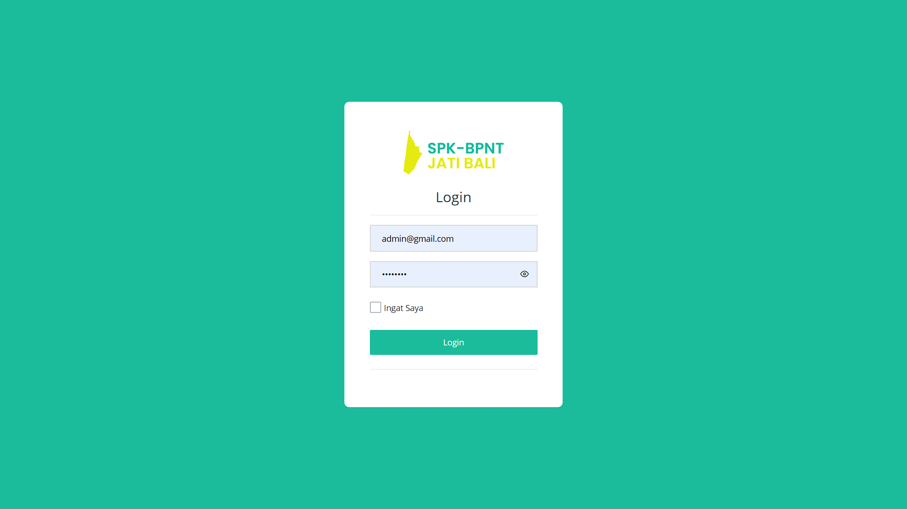
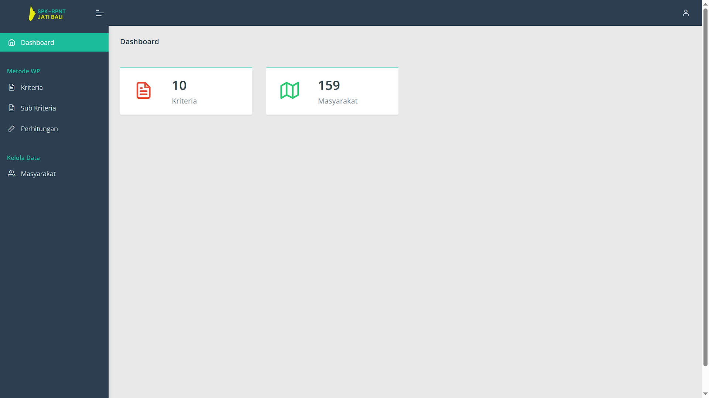
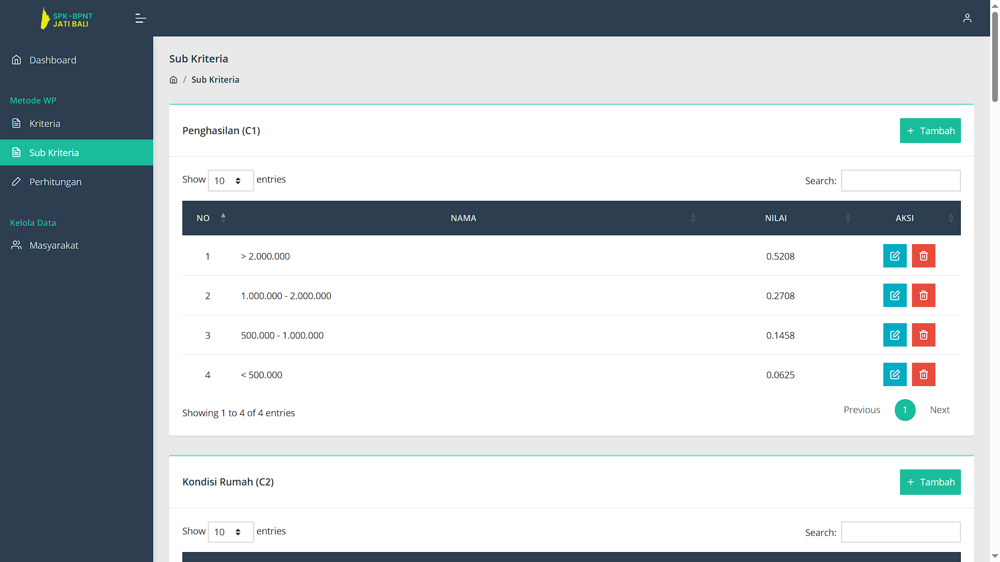
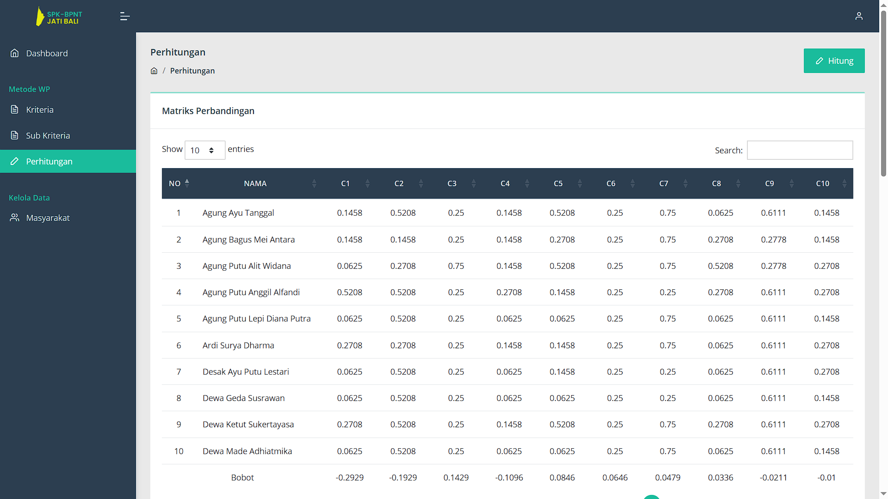

# 🎯 SPK Penerima Bantuan

**SPK Penerima Bantuan** is a web-based decision support system developed to assist local governments in determining which individuals or families are eligible to receive social assistance (BPNT) in the Jati Bali area. The eligibility decision is made using the **Weighted Product (WP)** method based on multiple criteria and sub-criteria.

This project was built as part of a final academic assignment.

---

## 📌 Key Features

-   ✅ Admin login system with "Remember Me" option
-   🧾 Criteria and sub-criteria management
-   👥 Community data management (add/import via Excel)
-   ⚖️ Eligibility scoring with **Weighted Product** method
-   📊 Automatically computed decision matrix
-   💬 SweetAlert2 for beautiful pop-up messages
-   📋 Responsive table display with **DataTables**
-   🔎 Enhanced dropdowns using **Select2**

---

## 🛠 Tech Stack

-   **Laravel 10** — Backend framework
-   **PHP 8.1** — Server-side scripting language
-   **MySQL** — Relational database
-   **Bootstrap** — Frontend UI framework
-   **DataTables** — Interactive tables
-   **SweetAlert2** — Enhanced alert messages
-   **Select2** — Customizable select boxes
-   **Maatwebsite Excel** — Excel import functionality
-   **mPDF** — PDF export and reporting

---

## 📸 Screenshots

### 🔐 Login Page



### 📊 Dashboard



### 📋 Community Data


### 📑 Criteria Management


### ⚖️ Sub-Criteria



### 🧮 Calculation Results



---

## ⚙️ Installation

```bash
# 1. Clone the repository
git clone https://github.com/Rafli1709/sistem-penerima-bantuan.git
cd sistem-penerima-bantuan

# 2. Install PHP dependencies
composer install

# 3. Copy environment config
cp .env.example .env

# 4. Generate application key
php artisan key:generate

# 5. Configure your .env database settings

# 6. Run migrations
php artisan migrate

# 7. Serve the application
php artisan serve
```

---

## 📄 License

MIT License © 2025  
Developed by Muhammad Rafli

---

## 🙌 Contributions

Contributions, issues, and feature requests are welcome!  
Feel free to check the [issues page](https://github.com/Rafli1709/sistem-penerima-bantuan/issues) or submit a pull request.

---
